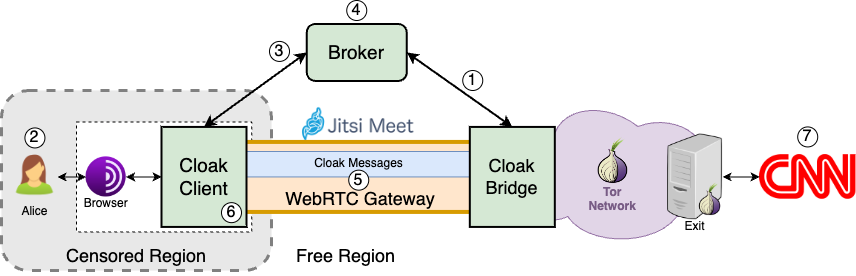

============
Architecture
============

|Cloak Architecture|

Cloak's architecture comprises three main components: the
client, the bridge, and the broker, each serving a crucial role
in enabling secure communication.

The client operates a Tor proxy that exposes a SOCKS interface
to local applications, such as the Tor Browser or Tor's
command-line interface. It enables the tunneling of local Tor
traffic by embedding it into video frames using the
`Protozoa <https://github.com/dmbb/protozoa>`__ encoders. These
video frames are then sent through the video stream of a
WebRTC-based carrier application, such as Jitsi Meet. At the
bridge's end these frames are decoded, after which the Tor
traffic is routed to a Tor relay responsible for forwarding it
to the "open" Tor network towards its destination.

The broker acts as a coordinator for all bridges forming
Cloak's infrastructure and runs a directory service that
allows users to locate available bridges. Apart from users, two
other main actors in the Cloak ecosystem are bridge
providers and broker providers. Bridge providers contribute to
the system by deploying server hardware and running Cloak's
bridge software. These providers can be volunteers, private
organizations, or public non-profit institutions supporting
internet freedom. On the other hand, the broker provider serves
as a trusted authority responsible for coordinating bridge
membership, ensuring compliance with community guidelines,
proper deployment of Cloak, and adherence to safety and
anonymity procedures.

To deploy a Cloak bridge, a bridge provider must:

#. Set up the server hardware
#. Install the Cloak software
#. Register the bridge in the broker service

Once deployed, the bridge listens for rendezvous IDs (RIDs)
sent by the broker, corresponding to the address a specific
Cloak user client will join to establish a video call
session with the bridge. The RID depends on the chosen
WebRTC-based carrier application, like a chatroom URL in Jitsi
Meet.
To demonstrate this process, consider Alice, a user in a
censored region using a Cloak bridge located in a free
Internet region. To access a website like www.cnn.com via the
Tor network in a censorship-resistant manner, Alice obtains the
Cloak PT client software and configures her Tor client to
use Cloak as the designated Pluggable Transport. When Alice
initializes her browser, the Cloak client generates a random
RID and password on a chosen WebRTC platform (e.g., Jitsi Meet)
and sends it to the broker. The broker selects an available
bridge and shares the RID and password with it. Subsequently,
the client and bridge join the designated chatroom, ensuring it
is password-protected for added security. Through the covert
channel established using Protozoa video encoding techniques,
Cloak ensures that the WebRTC stream appears as a regular
video call, providing robust resistance to traffic analysis
attacks.

