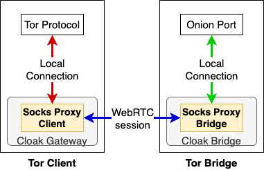

====================
SOCKS Proxy Protocol
====================

In the context of Cloak, as in that of other Tor pluggable
transports, SOCKS proxies play a crucial role in enabling
communication between the Tor Client and Cloak components
while facilitating the exchange of data.

In addition to the SOCKS proxy that Tor itself exposes to allow
external applications to route their traffic through the Tor
network, both Cloak client gateways and Cloak bridges
expose SOCKS proxy endpoints. The Cloak client gateway's
SOCKS proxy enables it to receive Tor traffic while the
Cloak bridge's reverse SOCKS proxy allows it to accept local
Tor connections.

When Tor is configured to use Cloak it routes the traffic
through its SOCKS proxies. The proxies act as middle-men
between the local Tor application and the WebRTC encoding and
decoding hooks.

|Cloak SOCKS proxies|

