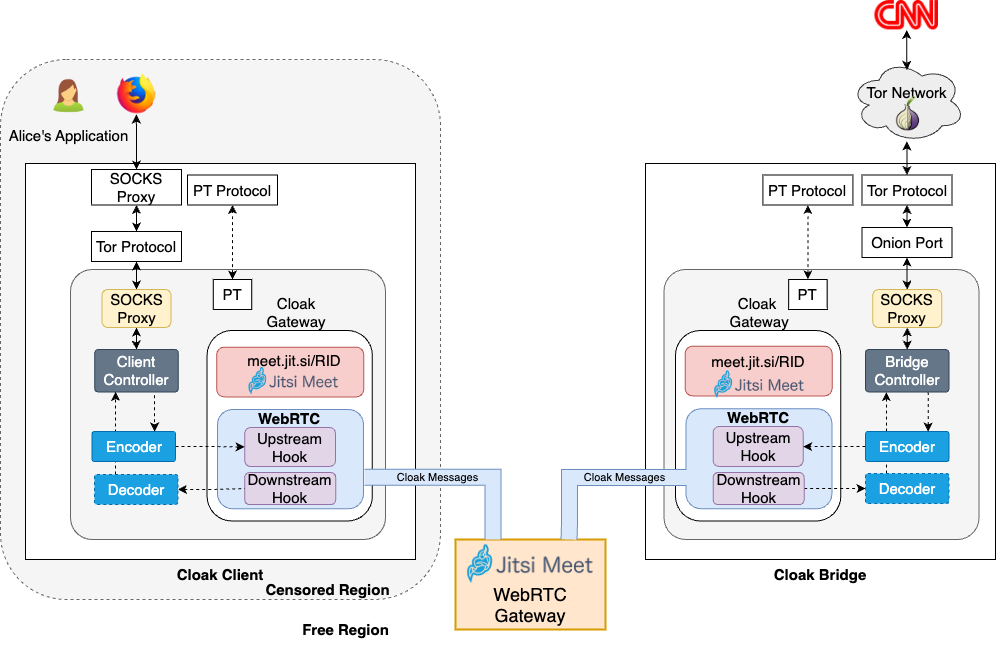
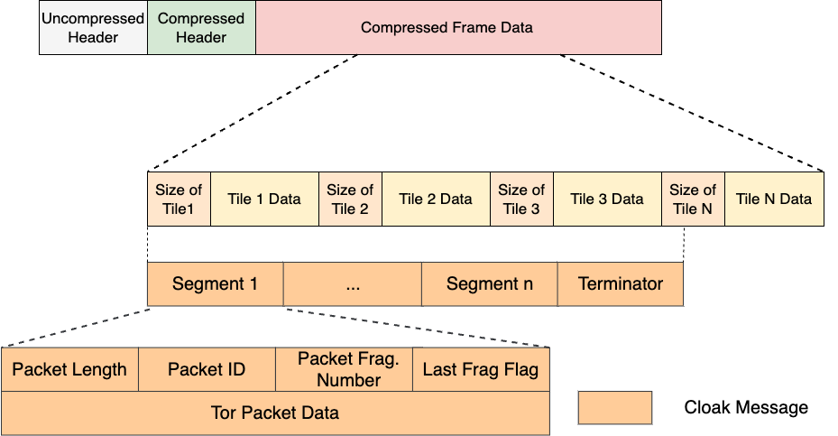

===============
System Features
===============

Carrier Media
=============

Cloak utilizes WebRTC (Web Real-Time Communication) as a
carrier medium for Tor traffic, providing a covert channel to
bypass censorship and ensure secure communication. WebRTC is a
powerful framework commonly used in real-time video
conferencing applications, and Cloak leverages its features
to create an inconspicuous tunnel for Tor traffic.

The process begins with the Cloak client. When a user
initiates a Tor connection, the Cloak client intercepts the
traffic and encodes it into video frames using the
`Protozoa` encoders.

These video frames, containing the Tor traffic, are then sent
through the video stream of a carrier WebRTC-based application,
such as Jitsi Meet. The carrier application, unaware of the
hidden Tor traffic, treats it as regular video data, making it
indistinguishable from a typical video call.

At the other end of the tunnel, a Cloak bridge receives the
video frames and decodes the embedded Tor traffic. The bridge
routes this data to a Tor relay, allowing it to proceed through
the Tor network and reach its intended destination securely and
anonymously.

By adopting this approach, Cloak effectively camouflages Tor
traffic within the guise of innocuous video calls, rendering it
highly resistant to traffic analysis attacks.

Rendezvous Addresses Protocol
=============================

To address the challenges in managing bridge addresses and
membership, Cloak proposes a comprehensive solution that
ensures secure and anonymous sharing of rendezvous chatroom IDs
with individual users. The system utilizes an out-of-band
channel to transmit RIDs, employing applications not based on
Tor to avoid detection by adversaries. Carrier applications are
carefully chosen to establish secure and encrypted end-to-end
connections, offering robust resilience against blockage
attempts.

Cloak adopts a structure similar to
`Snowflake's <https://gitlab.torproject.org/tpo/anti-censorship/pluggable-transports/snowflake>`__
proxy dissemination mechanism and introduces a dedicated
component called the broker. The broker's role is to connect
Cloak clients with available bridges through a simple API.
Clients share their intended RIDs along with corresponding
passwords, and the broker facilitates the connection to an
available bridge, allowing both parties to initiate a
WebRTC-based video call.

The rotation of chatroom RIDs is essential to enhance
resistance against censorship. Cloak addresses this by
generating unique RIDs per session per user. After the video
call session is terminated, a new RID is generated and shared
for subsequent sessions. This dynamic approach minimizes the
risk of detection by censors, as long-term or shared RIDs would
be more vulnerable to discovery.

To establish trust between clients and bridges, Cloak
bridges advertise their public key certificates to the broker.
Clients can download and verify these certificates to
authenticate the chosen bridge before establishing a covert
session, effectively solving the challenge of bridge
authentication.

Frame Encoding and Decoding Protocol
====================================

Cloak employs a covert frame encoding and decoding mechanism
that operates within the WebRTC framework, specifically
integrated into the Chromium Browser. This approach replaces
certain bits of the encoded video signal after the video
encoding engine processes it. To achieve this, the WebRTC
Protozoa stack incorporates two essential hooks for
intercepting media streaming in different directions: upstream
and downstream.

#. Upstream Hook

   -  The upstream hook intercepts outgoing frame data from a
      local camera device to the network.
   -  It is strategically placed after the raw video signal
      undergoes processing by the video engine but before the
      frame data is handed over to the transport layer to
      create Secure Real-time Transport Protocol (SRTP) packets
      for network transmission.

#. Downstream Hook

   -  The downstream hook intercepts incoming frame data from
      the network to the local screen.
   -  Positioned right after the transport layer reconstructs
      an encoded frame, which is transmitted in multiple
      network packets, but before it is delivered to the video
      engine for decoding and rendering on the screen.

|Cloak Components|

The core data structure employed for encoding and decoding is
known as the Encoded Frame Bitstream (EFB). This structure,
utilized by Protozoa as well, includes a header and partitions
dedicated solely to storing encoded video bytes. It effectively
segregates the zones where data can be encoded without
disrupting the video stream's functionality or leading to
losses. The EFB's design ensures that once generated by the
video encoding engine, it remains unmodified, undergoing
encryption and authentication measures before being assembled
into packets. As a result, it provides an ideal location for
embedding covert data without interfering with the application,
maintaining encryption and authentication integrity.

It is essential to exercise caution while manipulating the EFB,
as uncontrolled corruption may lead to issues with video
decoding at the receiver's end, affecting the WebRTC downstream
pipeline. The presence of corrupted frame data may trigger
congestion control mechanisms, such as the Picture Loss
Indication (PLI), within the accompanying RTCP control channel.
The PLI requests the re-transmission of a key frame in case of
decoding difficulties. Such congestion control mechanisms could
severely reduce channel bandwidth and inadvertently expose
Cloak to traffic analysis.

To circumvent this problem, the downstream hook employs a
pre-recorded sequence of valid encoded frames to feed the
WebRTC video decoder. By replacing corrupted frames received
over the network with pre-recorded ones, Cloak establishes a
covert channel without triggering any frame corruption control
mechanisms. This ensures that the channel bandwidth and traffic
patterns remain intact and resilient to traffic analysis.

In summary, the encoding and decoding strategy employed by
Cloak is codec and data structure agnostic. This flexibility
enables the encoding of various types of data into video
frames, allowing us to effectively replace bytes that, under
normal circumstances, represent video frame data with Tor
traffic data.

Cell Packet Format
==================

As Cloak adapted to newer WebRTC-based videocall
applications using the VP9 video codec, adjustments were made
to Protozoa's Encoded Frame Bitstreams (EFBs). The main
difference between VP8 and VP9 codecs lies in VP9's additional
compressed header alongside the pre-existing uncompressed
header.

To ensure frame integrity and prevent corruption, the offsets
were recalculated to account for the new header. By leveraging
the VP9 Decoding Specification and WebRTC's VP9 decoding
structure, the EFBs were modified to replace carrier video bits
with covert data while preserving the header structure for
seamless decoding.

|VP9 EFB with covert data|

WebRTC's encoded_frame.h structure was also enhanced to include
information about the codec used to encode the frame. This
enables dynamic adaptation to support multiple video codecs
during runtime.

It was observed that VP9 encoded frames significantly differed
from VP8 frames, triggering frame corruption control mechanisms
when using the wrong frames. To overcome this, a new sequence
of valid encoded frames specifically for VP9 was recorded, and
dynamic switching of pre-recorded frames during runtime was
implemented based on the codec used for a particular session.

   
